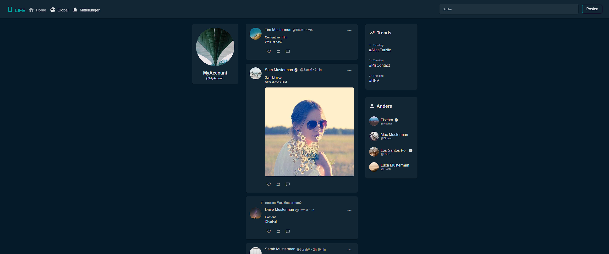

# Project last **UPDATED ON May. 18, 2021**

**Project beginn May. 06. 2021 - Ended: May. 18. 2021**

> **This project was created in a short time and never completed! And doesnt follow codeing/quality standarts**

REST API + Website

## Before using
 - Run MongoDB locally
 - Run `npm install` or `yarn` in your root project folder
 - Change DB URL in common/services/mongoose.service.js
 - Run `npm run start`

## OLD TODO List:
UI:
- check if User info (Bio,Website,...) is empty string and dont show up {DONE}
- return Default image or build default with css {DONE (default Image)}
- Search Users (just load first 4 items) {DONE} <-- TEST IT
- Post Comments {DONE}
- check if Reposted by user (disable btn if Reposted) / delete Repost if clicked again ?v0.1 {Checked but not showed in UI}

- when hover over time show full time
- follower list for User
- notifications
- Show number of likes (Done), Reposts, Comments

Server:
- Delete Post {- Dont delete repost with content} {DONE}
- Like / dislike {DONE}
- Search Users {Look in Username and Profilename} {DONE}
- Birthday format (just Date) {is ok}

- dont load all notifications (do it like post.list)
- Comments <-- 1 (+Delete your own Comment) v0.1

- Dont throw error in console on UserImage check (?n)
- Dont allow to Repost own Post (simple Repost) because on delete of repost the post deletes too (simple repost) {DONE}
- Polls
- Delete Profilpicture

IDEA:
- Post creation ui (Repost, img,...) [load picture if choosen] {dont work}
- metions clientside -> new DB row (array) [same with hashtags]